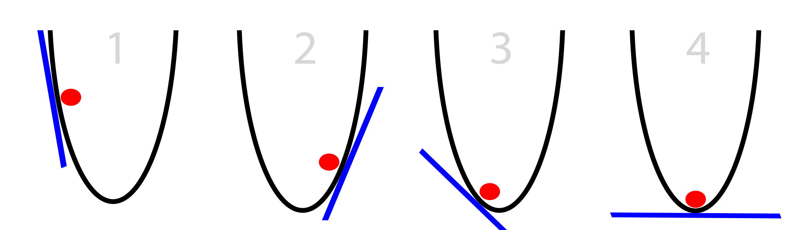
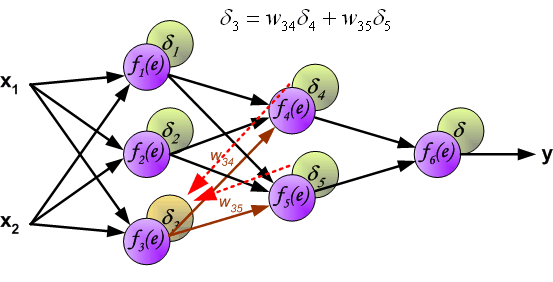

## Agenda

1. Neural Networks
 * Uses
 * Basic concepts: Perceptron, activations, loss functions
 * Multilayer perceptron
 * Gradient Descent and Back propagation
 * Convolutional Neural Networks
 * Transfer learning in CNN

2. Keras
 * Basic API
 * MLP implementation
 * CNN implementation

--- .class #id 

## Neural Networks : Uses

* Typical current use case for Neural Networks is in the field of computer vision and NLP
* Traditional methods and analysis are not going to be replaced by neural networks
* This session will introduce Multi Layer Perceptron Model in the classification setting, aim: to make you self explorers.
* Current state of the art in Neural Networks: Convolutional Neural Networks, Recurrent Neural Networks


--- .class #id


## Basic Concepts

* Central Concepts:
 * Layers: Input, Hidden and Output
 * Activations
 * Cost functions

 

--- .class #id

## Basic Concepts 

* Layers: Input, Hidden and Output


<footer style='size:0.1px;' > http://neuralnetworksanddeeplearning.com/</footer>


--- .class #id

## Basic Concepts

* Activation functions and Cost Functions


* For example : Excel Demo


--- .class #id

## Basic Concepts:

<iframe width="402" height="346" frameborder="0" scrolling="no" src="https://onedrive.live.com/embed?cid=93C4DDFD9869A0CF&resid=93C4DDFD9869A0CF%21204&authkey=ACeZ2LCmVx_Q7WA&em=2&AllowTyping=True&wdHideGridlines=True&wdHideHeaders=True"></iframe>


--- .class #id

## Gradient Descent: Optimising a convex function

* We have seen that there is always a cost function, to minimize cost, Gradient Descent and its variations are used.

* The primary identity is:
 
 $$w^{new}=w^{old}-\eta \nabla C(w)$$ 
* Here $w^{new}, w^{old}$ are model parameter vectors, $C(w)$ is the cost function and $\nabla$ is the gradient


--- .class #id
 

## Gradient Descent: Optimising a convex function

* This is a simplistic representation:




--- .class #id

## Backpropagation:

* Different weight vectors in different layers



* A more involved (one of the best discussions I could find) can be accessed from here http://neuralnetworksanddeeplearning.com/chap2.html


--- .class #id


## Convolutional Neural Networks

* Flattening an image and using it as an input has some disadvantages:
 * There is information in spatial arrangement, flattening might destroy that
 * The number of weights to be estimated will increase if neural networks with many layers and moderate resolution is used. (224*224 pixels and RGB channels)

* CNN reduce the number of weights to be estimated and also preserve the spatial information


--- .class #id

## Convolutional Neural  Networks

* What is convolution?


* Kernel


* Source: http://deeplearning.net/software/theano/tutorial/conv_arithmetic.html


--- .class #id

## Convolutional Neural Networks

* Related terms: Padding


* A couple of factors affect the output size of output from a convolving kernel:
 * Zero padding
 * Kernel Size
 * Strides
* Source: http://deeplearning.net/software/theano/tutorial/conv_arithmetic.html 


--- .class #id

## Convolutional Neural Networks

* Effect of no padding, unit strides:


* Source: http://deeplearning.net/software/theano/tutorial/conv_arithmetic.html


--- .class #id

## Convolutional Neural Networks
* Double padding, unit strides:


--- .class #id


## Convolutional Neural Networks

* Same size output is also possible (is desirable)


* Source: http://deeplearning.net/software/theano/tutorial/conv_arithmetic.html

--- .class #id

## Convolutional Neural Networks

* Neural Network with convolutional layers


* Assume there is a 5 by 5 kernel with a bias term and there are 11 such kernels in this layer, the how many parameters will be needed? Compare with a vanilla MLP?

* Source: http://cs231n.github.io/convolutional-networks/


--- .class #id

## Convolutional Neural Networks

* CNNs not only have convolutional layers, they also have pooling layers, that reduce the size of image


* Source: http://cs231n.github.io/convolutional-networks/


--- .class #id

## Convolutional Neural Networks
* This is how pooling layer works:


* Source: http://cs231n.github.io/convolutional-networks/


--- .class #id

## Convolutional Neural Networks

* Sample complete CNN architecture (LeNet5)


--- .class #id

## Convolutional Neural Networks

* There are other popular architectures AlexNet, VGGNet, ResNet
* Even after using convolving kernels, CNNs are resource intensive and require large amounts of images to train.
* To tackle this issue, one can use a pre-trained model and fine tune it to specific classification tasks, this is called **Transfer Learning**


--- .class #id

## Convolutional Neural Networks: Transfer Learning
 
* Here is a schematic:
 
 


--- .class #id

## Keras: Coding the networks

* Keras is a library providing high level functions to define a variety of Neural Networks
* The computations are still done by a Tensorflow or Theano backend
* Keras api makes the code writting more intuitive and abstracts away some of the unneccessary details from the user
* If you are not publishing papers or experimenting with new ways of creating Neural Networks, keras will serve your purpose.


--- .class #id

## Keras : API overview

* Keras has a couple of classes that help in defining a Neural Network. Major classes are:
 * Models: Defines a model container and relevant model methods
 * Layers: Helps define different types of layers, fully conected, convolutional, pooling and recurrent
 * Losses: Defines various loss functions: Cross Entropy, Mean squared loss
 * Optimizers: Defines various optimizers: SGD, Adam etc
 * Activations: Defines various activations: Relu, Softmax, Sigmoid etc.

* Lets's look at a sample code
 

--- .class #id


## Keras: Basic API Sample


```python
from keras.models import Sequential
from keras.layers import Dense,Activation
from keras.optimizers import SGD

## Include a container
model=Sequential()

## Model Specification
#Layer 1
model.Add(Dense(Number_of_neurons,input_shape(n,m)))
model.Add(Activation('relu'))
#Layer 2
model.Add(Dense(Number_of_neurons),input_shape(n,m))
model.Add(Activation('sigmoid'))
.....
.....
.....

```


--- .class #id

## Keras: Basic API Sample


```python
....
....
#Layer N
model.Add(Dense(Number_of_neurons),input_shape(n,m))
model.Add(Activation('softmax'))

#Instantiate an optimizer
sgd=SGD(lr=0.01, decay=1e-6, momentum=0.9, nesterov=True)
model.compile(loss='categorical_crossentropy',optimiser=sgd,metrics=['accuracy'])

# Fit the model
model.fit(X,y,batch_size=n,epochs=m)

```

